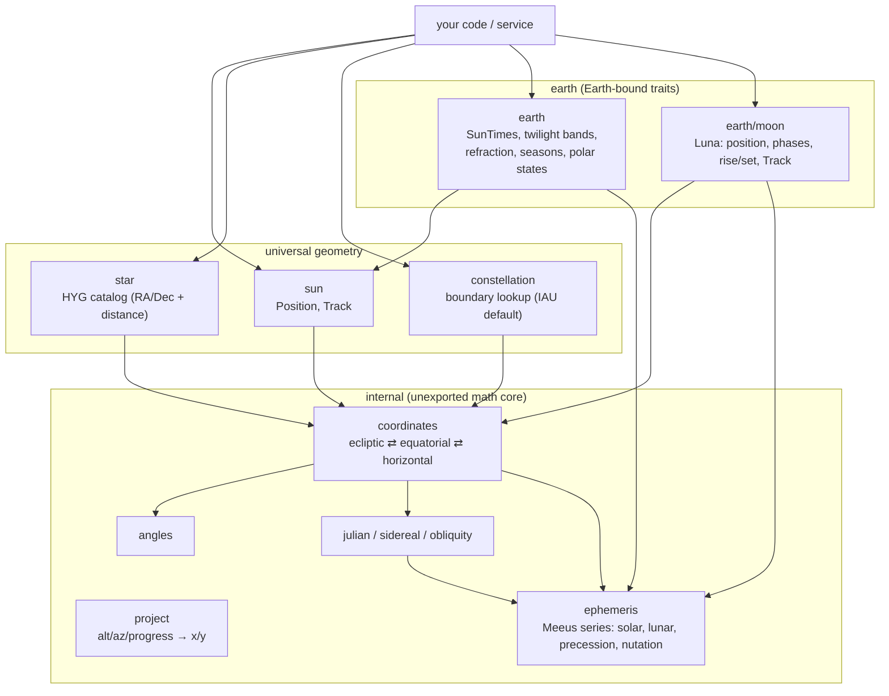

# 🔭 go-astronomy

> Observer-aware Sun, Moon, star, and constellation positions for Go — altitude/azimuth, twilight bands, arc tracks, and moon phases for any `(latitude, longitude, timezone, time)`.

[](https://pkg.go.dev/github.com/Bugs5382/go-astronomy)
[](https://goreportcard.com/report/github.com/Bugs5382/go-astronomy)
[](https://github.com/Bugs5382/go-astronomy/actions/workflows/job-go-lang-ci.yaml)
[](./LICENSE)

`go-astronomy` computes where the Sun, Moon, and stars are in the sky for a given observer and instant. It emits **degrees** (altitude, azimuth) and time-progress — never pixels — so any consumer can drive an animated sky, a rise/set table, a twilight timeline, or a moon-phase widget from the same data.

It is designed for a service that computes a distinct sky per site visitor, so the API is **stateless, deterministic, and concurrency-safe**: `time.Time` is always a parameter, never captured at construction. The math is an in-house implementation of Jean Meeus' *Astronomical Algorithms* with no third-party ephemeris dependency (arcminute-class accuracy).

> **Status:** v1.0.0 is in active development. Sections below mark not-yet-shipped surface as **(roadmap)**; treat those signatures as indicative, not final.

## 🚀 Quick start

Install:

```sh
go get github.com/Bugs5382/go-astronomy
```

Where is the Sun for an observer right now, and when does it rise and set today? *(roadmap — indicative API)*

```go
package main

import (
	"fmt"
	"time"

	"github.com/Bugs5382/go-astronomy"
	"github.com/Bugs5382/go-astronomy/earth"
)

func main() {
	tz, _ := time.LoadLocation("America/New_York")
	obs := astronomy.Observer{Lat: 40.678, Lng: -73.944, TZ: tz} // Brooklyn, NY
	now := time.Now().In(tz)

	// Earth vantage: geometric altitude/azimuth of the Sun's disc center.
	pos := earth.SunPosition(obs, now)
	fmt.Printf("sun alt=%.2f° az=%.2f°\n", pos.Altitude, pos.Azimuth)

	// Earth-bound traits: one civil day of twilight bands, resolved in obs.TZ.
	day, err := earth.NewSunTimes(obs, now)
	if err != nil {
		panic(err)
	}
	if noon, ok := day.SolarNoon(); ok {
		fmt.Println("solar noon:", noon.Format(time.Kitchen))
	}
}
```

The library returns `(value, bool)` / `(value, error)` where a value may be absent (for example, no sunrise during a polar day) — never `-1` or `false` sentinels. Polar conditions are an explicit state (`MidnightSun` / `PolarNight`), never a nil panic.

Every returned `error` is a [go-apperr](https://github.com/Bugs5382/go-apperr) coded error carrying a stable numeric code. Match a condition with `errors.Is` (for example `earth.ErrInvalidLatitude`) or recover the code with `apperr.Code(err)`; `astronomy.Errors()` exposes the code registry (used for `Present`, `Describe`, and a Markdown code table). The library is quiet by default — it never logs on its own — but the registry has [go-log](https://github.com/Bugs5382/go-log) wired as go-apperr's logger, so a service that renders a coded error with `Registry.PresentContext` gets a structured line correlated with its OpenTelemetry trace when one is active. OpenTelemetry is a transitive dependency only; this library never starts a tracer or exporter, so it stays dormant until the surrounding service turns it on.

## ✨ Features

- ☀️ **Universal Sun physics** — `sun.ApparentDiameter` / `sun.ApparentSemidiameter` give the Sun's apparent angular size for any distance in AU, from the semidiameter-at-1-AU constant. This is the only observer-independent part of the Sun, so any vantage body reuses it with its own distance.
- 🌅 **Earth vantage on the Sun** — `earth.SunPosition` (geometric alt/az of the disc center, paired with apparent diameter) and `earth.SunTrack` (arc samples of `{Time, Altitude, Azimuth, TimeProgress}`). The alt/az, sidereal time, and Earth-Sun distance are all Earth-specific, so they live with the Earth vantage rather than in `sun`.
- 🌇 **Earth twilight bands** *(roadmap)* — `earth.NewSunTimes` resolves one civil day in the observer's timezone with Earth refraction (−0.833° upper limb, Bennett): astronomical/nautical/civil dawn, sunrise, golden hour, day split at solar noon, golden hour, sunset, and the matching dusk bands. Each band is `{from, to, seconds}`.
- 🌗 **Moon (Luna)** *(roadmap)* — `earth/moon` position and apparent position, next rise/set, the eight named phases, `Age`, `Illumination`, `PhaseAngle`, next new/full, blue-moon detection, and `Track`. The Moon belongs to Earth; other bodies own their own moons.
- ⭐ **Stars** *(roadmap)* — an embedded HYG-derived named-star catalog with RA/Dec **and distance**, projected to alt/az for the observer and instant.
- 🌌 **Constellations** *(roadmap)* — boundary lookup by RA/Dec over the IAU (Delporte/Roman) default dataset, plus per-observer visibility. The lookup machinery is universal; the dataset is consumer-overridable.
- 📐 **Discs, not points** — Sun and Moon positions are the **center of the disc**, always paired with **angular diameter**, so a consumer can size the disc and compute alignment/overlap (eclipses, occultations) purely from the data.
- 🖥️ **Pixel-agnostic projection** *(roadmap)* — `internal/project` maps `(altitude°, azimuth°, timeProgress)` to `(x, y)` with selectable strategies (`XMode` = time-progress or azimuth; `YMode` = normalized-by-peak or geometric) and a configurable horizon anchor.
- 🧭 **Configurable segmentation** *(roadmap)* — twilight thresholds and band labels are data. Earth defaults ship (−18/−12/−6°, golden hour, sunrise/sunset), but a consumer can redefine them wholesale.
- 🕛 **Seamless midnight rollover** *(roadmap)* — a continuous instant resolver answers "which band, and how far through it, at `now`" and stitches across midnight with no gap. Callers ask only for `now`, never for the previous or next day.
- 🧵 **Stateless & concurrency-safe** — every call takes the observer and `time.Time`; nothing is captured at construction, so the same instance serves many visitors at once.

## 📋 Requirements

- Go **`>= 1.27`**

## 🧭 Architecture

Universal celestial geometry and per-body trait packages sit over an unexported `internal/` math core. Only the **Sun** is universal to the solar system; per-body packages own that body's observer, atmosphere, and naming traits. Consumers import the universal packages plus the body package they need (`earth`, including `earth/moon`).



Adding a future body (for example, `mars/` with its own moons and `SunTimes` equivalent) requires no change to `sun`.

## 🛠️ Working in the repo

The repo uses a [`Taskfile`](https://taskfile.dev):

```sh
task build        # go build ./...
task test         # go test ./...
task test-cover   # go test ./... -cover
task fmt          # gofmt + goimports
task lint         # gofmt check, golangci-lint, yamllint
task license      # verify MIT headers (golic, dry run)
task license:fix  # inject any missing MIT headers
```

Plain `go` works too:

```sh
go build ./...
go test ./...
```

Commit discipline, AI-tell/emoji blocking, and the pre-push gofmt/vet/lint/test gate are enforced by the governance hooks. Install them once per clone:

```sh
bash .claude/hooks/install.sh
```

## 📚 Documentation

- 🌐 **API reference** — [pkg.go.dev/github.com/Bugs5382/go-astronomy](https://pkg.go.dev/github.com/Bugs5382/go-astronomy)
- 🤖 **Working in this repo (agents)** — [`AGENTS.md`](./AGENTS.md)
- 📖 **Guides** — a Docusaurus documentation site is planned; this section will link it once it ships.

Accuracy target is amateur / arcminute-class. The library omits nutation, ΔT, and leap seconds — they sit below that precision floor.

## 🤝 Contributing

Contributions are welcome — bug reports, fixes, new coverage, and docs improvements.

1. 🍴 **Fork** the repo and create a topic branch (`<type>/<issue#>-<slug>`).
2. ✅ **Add tests** for any behavior change. Run the suite with `go test ./...` (or `task test`).
3. 🧹 **Lint and format** with `task lint` from the repo root (commits follow [Conventional Commits](https://www.conventionalcommits.org)).
4. 🚀 **Open a PR.** CI runs build, tests, and linters on every push.

## 🙏 Acknowledgements

- [Jean Meeus](https://en.wikipedia.org/wiki/Jean_Meeus), *Astronomical Algorithms* — the algorithmic foundation. The series in `internal/ephemeris` were ported from [`soniakeys/meeus`](https://github.com/soniakeys/meeus), which this library no longer depends on.
- The [HYG star database](https://codeberg.org/astronexus/hyg) (Hipparcos-Yale-Gliese) — the source for the embedded star catalog, used under [CC BY-SA 4.0](https://creativecommons.org/licenses/by-sa/4.0/).
- The IAU constellation boundaries of Eugène Delporte (1930), digitized by Nancy Roman (1987) as [VizieR VI/42](https://vizier.cds.unistra.fr/viz-bin/VizieR?-source=VI/42) — the source for the embedded boundary table.

See [`NOTICE`](./NOTICE) for the full attribution and licensing of the embedded data.

## 📄 License

[MIT](./LICENSE)
