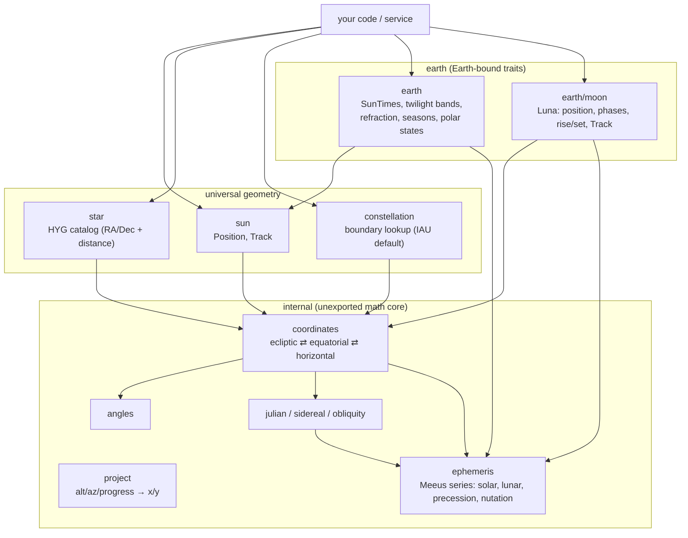

# go-astronomy 🔭

> 🌍 Observer-aware Sun, Moon, star, and constellation positions for Go — altitude/azimuth, twilight bands, arc tracks, and moon phases for any `(latitude, longitude, timezone, time)`.

[](https://pkg.go.dev/github.com/Bugs5382/go-astronomy)
[](https://goreportcard.com/report/github.com/Bugs5382/go-astronomy)
[](https://github.com/Bugs5382/go-astronomy/actions/workflows/job-go-lang-ci.yaml)
[](./LICENSE)

`go-astronomy` computes where the Sun, Moon, and stars are in the sky for a given observer and instant. It emits **degrees** (altitude, azimuth) and time-progress — never pixels — so any consumer can drive an animated sky, a rise/set table, a twilight timeline, or a moon-phase widget from the same data.

It is designed for a service that computes a distinct sky per site visitor, so the API is **stateless, deterministic, and concurrency-safe**: `time.Time` is always a parameter, never captured at construction. The math is an in-house implementation of Jean Meeus' *Astronomical Algorithms* with no third-party ephemeris dependency (arcminute-class accuracy).

> **Status:** v1.0.0. Everything below ships, and every signature shown matches `go doc`. One item is marked **(roadmap)** where it appears: blue-moon detection.

## 🚀 Quick start

Install:

```sh
go get github.com/Bugs5382/go-astronomy
```

Where is the Sun for an observer right now, and when does it rise and set today?

```go
package main

import (
	"fmt"
	"time"

	"github.com/Bugs5382/go-astronomy"
	"github.com/Bugs5382/go-astronomy/earth"
)

func main() {
	tz, _ := time.LoadLocation("America/New_York")
	obs := astronomy.Observer{Lat: 40.678, Lng: -73.944, TZ: tz} // Brooklyn, NY
	now := time.Now().In(tz)

	// Earth vantage: geometric altitude/azimuth of the Sun's disc center.
	pos := earth.SunPosition(obs, now)
	fmt.Printf("sun alt=%.2f° az=%.2f°\n", pos.Altitude, pos.Azimuth)

	// Earth-bound traits: one civil day of twilight bands, resolved in obs.TZ.
	day, err := earth.NewSunTimes(obs, now)
	if err != nil {
		panic(err)
	}
	if noon, ok := day.SolarNoon(); ok {
		fmt.Println("solar noon:", noon.Format(time.Kitchen))
	}
}
```

The library returns `(value, bool)` / `(value, error)` where a value may be absent (for example, no sunrise during a polar day) — never `-1` or `false` sentinels. Polar conditions are an explicit state (`MidnightSun` / `PolarNight`), never a nil panic.

Every returned `error` is a [go-apperr](https://github.com/Bugs5382/go-apperr) coded error carrying a stable numeric code. Match a condition with `errors.Is` (for example `earth.ErrInvalidLatitude`) or recover the code with `apperr.Code(err)`; `astronomy.Errors()` exposes the code registry (used for `Present`, `Describe`, and a Markdown code table). The library is quiet by default — it never logs on its own — but the registry has [go-log](https://github.com/Bugs5382/go-log) wired as go-apperr's logger, so a service that renders a coded error with `Registry.PresentContext` gets a structured line correlated with its OpenTelemetry trace when one is active. OpenTelemetry is a transitive dependency only; this library never starts a tracer or exporter, so it stays dormant until the surrounding service turns it on.

## ✨ Features

- ☀️ **Universal Sun physics** — `sun.ApparentDiameter` / `sun.ApparentSemidiameter` give the Sun's apparent angular size for any distance in AU, from the semidiameter-at-1-AU constant. This is the only observer-independent part of the Sun, so any vantage body reuses it with its own distance.
- 🌅 **Earth vantage on the Sun** — `earth.SunPosition` (geometric alt/az of the disc center, paired with apparent diameter) and `earth.SunTrack` (arc samples of `{Time, Altitude, Azimuth, TimeProgress}`). The alt/az, sidereal time, and Earth-Sun distance are all Earth-specific, so they live with the Earth vantage rather than in `sun`.
- 🌇 **Earth twilight bands** — `earth.NewSunTimes` resolves one civil day in the observer's timezone with Earth refraction (−0.833° upper limb, Bennett): astronomical/nautical/civil dawn, sunrise, golden hour, day split at solar noon, golden hour, sunset, and the matching dusk bands. Each band is `{from, to, seconds}`.
- 🌗 **Moon (Luna)** — `earth/moon` position and apparent position, next rise/set, the eight named phases, `Age`, `Illumination`, `PhaseAngle`, next new/full, and `Track`. `PhaseAt` names the phase from the Moon's elongation from the Sun rather than from its age, so the name follows the sky rather than a mean cycle length. Blue-moon detection is **(roadmap)**. The Moon belongs to Earth; other bodies own their own moons.
- 🪐 **Planets** — the `planet` package places Mercury through Neptune for an observer: topocentric apparent position (light-time, aberration, nutation), apparent diameter from the same distance, phase angle, illuminated fraction, magnitude (Mallama and Hilton 2018), elongation with a near-Sun flag, and next rise, set, and transit. `planet.Heliocentric` publishes each planet's observer-independent position, Earth included. Positions come from a generated, truncated VSOP87 table and match JPL Horizons to about 1″ (2″ for Uranus and Neptune); a program that never imports `planet` never links its tables.
- ⭐ **Stars** — an embedded HYG-derived named-star catalog with RA/Dec **and distance**, projected to alt/az for the observer and instant.
- 🌌 **Constellations** — `constellation.FindAt` looks up the constellation containing an RA/Dec over the IAU (Delporte/Roman) default dataset, with `List` and `Lookup` alongside it. The lookup machinery is universal; the dataset is consumer-overridable.
- 📐 **Discs, not points** — Sun and Moon positions are the **center of the disc**, always paired with **angular diameter**, so a consumer can size the disc and compute alignment/overlap (eclipses, occultations) purely from the data.
- 🖥️ **Pixel-agnostic projection** — the `project` package maps `(altitude°, azimuth°, timeProgress)` to `(x, y)` with selectable strategies (`XMode` = time-progress or azimuth; `YMode` = normalized-by-peak or geometric) and a configurable horizon anchor.
- 🧭 **Configurable segmentation** — twilight thresholds and band labels are data. Earth defaults ship (−18/−12/−6°, golden hour, sunrise/sunset), and `earth.NewSunTimesWith` takes a `Segmentation` to redefine them wholesale.
- 🕛 **Seamless midnight rollover** — `earth.SegmentAt` answers "which band, and how far through it, at `now`" and stitches across midnight with no gap. Callers ask only for `now`, never for the previous or next day.
- 🧵 **Stateless & concurrency-safe** — every call takes the observer and `time.Time`; nothing is captured at construction, so the same instance serves many visitors at once.

## 🪐 Planets

The `planet` package places Mercury, Venus, Mars, Jupiter, Saturn, Uranus, and Neptune in an observer's sky, in the same shape as the Moon, and publishes each planet's heliocentric position. Positions come from VSOP87 tables generated into the package, so a program that never imports `planet` never links them.

### Position, brightness, and phase

```go
greenwich := astronomy.Observer{Lat: 51.4769, Lng: -0.0005, TZ: time.UTC}
when := time.Date(2027, 2, 19, 22, 0, 0, 0, time.UTC) // Mars near opposition

r, err := planet.Position(greenwich, planet.Mars, when)
if err != nil {
	panic(err)
}
fmt.Printf("alt %.2f az %.2f\n", r.Altitude, r.Azimuth)                 // alt 44.53 az 129.60
fmt.Printf("%.2f arcsec, mag %.2f\n", float64(r.Diameter)*3600, r.Magnitude) // 13.82 arcsec, mag -1.28
fmt.Printf("%.1f%% lit, light-time %v\n", 100*r.Illuminated, r.LightTime.Round(time.Second)) // 99.9% lit, light-time 5m38s
```

`Result` embeds `astronomy.Position` (topocentric geometric altitude and azimuth, and the apparent diameter from the same distance) and adds the topocentric apparent RA/Dec of date, distance in au, light-time, magnitude, phase angle, illuminated fraction, elongation from the Sun, and a `NearSun` flag. Magnitudes follow Mallama and Hilton (2018), the Astronomical Almanac formulas, with Saturn's rings from their tilt.

### Rise, set, and transit

```go
rise, ok, err := planet.NextRise(greenwich, planet.Jupiter, time.Date(2027, 9, 1, 0, 0, 0, 0, time.UTC))
transit, _, _ := planet.NextTransit(greenwich, planet.Jupiter, rise)
set, _, _ := planet.NextSet(greenwich, planet.Jupiter, transit)
// 05:06:53, 11:58:08, 18:49:07 UTC; ok is false when nothing happens within 30 days
```

### Heliocentric positions

```go
h, err := planet.Heliocentric(planet.Jupiter, when) // ecliptic of date: L, B in degrees, R in au
v := h.Vector()                                     // rectangular, au
```

`Heliocentric` accepts `planet.Earth`, so the geometric view of one planet from another is the difference of two vectors.

### Accuracy

Against JPL Horizons DE441 (2020 to 2030, plus two conjunctions), the apparent place is within 0.3″ for Mercury, Venus, and Mars, 0.6″ for Jupiter and Saturn, and 1.7″ for Uranus and Neptune. Magnitudes agree to 0.08, and rise, set, and transit fall within Horizons' one-minute step. The VSOP87 coverage, frames, units, and sources are on the [planet reference page](./website/docs/reference/planet.md).

## ⛰️ Observer height

An `Observer`'s height above sea level is optional. From height the sea horizon lies below the astronomical horizon by the dip, so the Sun and Moon rise earlier and set later (7.3 minutes at Denver's 1609 m in June), and the height enters their parallax. There are three ways to give an observer its height.

### Always sea level

Leave `Height` out. The zero value is `astronomy.SeaLevel`, the answers are the sea-level answers, and nothing reaches the network.

```go
obs := astronomy.Observer{Lat: 40.71, Lng: -74.01, TZ: tz}
```

### By hand

Set `Height` with `astronomy.Feet` or `astronomy.Meters` (1 ft = 0.3048 m exactly). Any real value is used as given, with no check against the terrain: below sea level (the Dead Sea shore is -430 m), a mountain, or a plane at cruising altitude. New York at 5000 ft is valid on purpose.

```go
obs := astronomy.Observer{Lat: 40.71, Lng: -74.01, TZ: tz, Height: astronomy.Feet(5000)} // same as Meters(1524)
day, err := earth.NewSunTimes(obs, date) // sunrise 7.2 minutes earlier than at sea level
```

Only NaN and the infinities are invalid: every function that returns an error rejects them with `astronomy.ErrInvalidHeight` (code 7011), and `Height.Err()` checks one up front.

### Lookup

An `astronomy.ElevationResolver` finds the height at a coordinate. `Elevation(ctx, lat, lon)` returns `(Height, source, error)`, with the source `"caller"`, `"static"`, `"open-meteo"`, or `"sea-level"`. Every lookup failure falls back to sea level with the source `"sea-level"`; the error is only for a cancelled or expired context.

```go
// The Open-Meteo default: worldwide, free, no key.
obs, source, err := openmeteo.ResolveObserver(ctx, 39.74, -104.99)

// Or composed: a height you already have, then a fixed value, then Open-Meteo.
resolver := astronomy.ChainElevation(
	astronomy.CallerElevation(weatherHeight, haveWeatherHeight), // "caller"
	astronomy.StaticElevation(astronomy.Meters(21)),             // "static"
	openmeteo.New(openmeteo.WithHTTPClient(client)),             // "open-meteo"
)
obs, source, err = astronomy.ResolveObserverWith(ctx, resolver, lat, lon)
```

The `openmeteo` resolver respects `ctx`, bounds each lookup with a default 10 s timeout (`WithTimeout`), takes an injected `*http.Client` (`WithHTTPClient`), caches each 0.01° cell in process with no expiry (`WithRound`, `Cached`, `Store`), and logs through go-log: coordinates at debug, fallbacks at warn, nothing else about the caller. It lives in its own package, so a program that never imports it never links `net/http`.

### Moving observers

A caller in motion, such as a plane, passes the position and height for each instant to each time-based call. `Example_flightNYCToLondon` follows a JFK to Heathrow flight at 36000 ft: at 04:54 UTC over the Atlantic the Sun is up for the plane (-2.43°, above its dipped horizon of -3.91°) but not yet for the ocean below.

```go
for _, f := range []float64{0, 0.25, 0.5, 0.7, 0.75, 1} {
	lat, lng := greatCircle(jfk, lhr, f) // the point f of the way along the route
	obs := astronomy.Observer{Lat: lat, Lng: lng, Height: astronomy.Feet(36000)}
	sun := earth.SunPosition(obs, depart.Add(time.Duration(f*float64(7*time.Hour))))
	up := sun.Altitude > earth.HorizonAltitude-earth.HorizonDip(obs.Height)
	_ = up
}
```

## 📋 Requirements

- Go **`>= 1.27`**

## 🧭 Architecture

Universal celestial geometry and per-body trait packages sit over an unexported `internal/` math core. Only the **Sun** is universal to the solar system; per-body packages own that body's observer, atmosphere, and naming traits. Consumers import the universal packages plus the body package they need (`earth`, including `earth/moon`).



Adding a future body (for example, `mars/` with its own moons and `SunTimes` equivalent) requires no change to `sun`.

## 🛠️ Working in the repo

The repo uses a [`Taskfile`](https://taskfile.dev):

```sh
task build        # go build ./...
task test         # go test ./...
task test-cover   # go test ./... -cover
task fmt          # gofmt + goimports
task lint         # gofmt check, golangci-lint, yamllint
task license      # verify MIT headers (golic, dry run)
task license:fix  # inject any missing MIT headers
```

Plain `go` works too:

```sh
go build ./...
go test ./...
```

Commit discipline, AI-tell/emoji blocking, and the pre-push gofmt/vet/lint/test gate are enforced by the governance hooks. Install them once per clone:

```sh
bash .claude/hooks/install.sh
```

## 📚 Documentation

- 🌐 **API reference** — [pkg.go.dev/github.com/Bugs5382/go-astronomy](https://pkg.go.dev/github.com/Bugs5382/go-astronomy)
- 🤖 **Working in this repo (agents)** — [`AGENTS.md`](./AGENTS.md)
- 📖 **Guides** — a Docusaurus documentation site is planned; this section will link it once it ships.

Accuracy target is amateur / arcminute-class. The Sun and Moon are computed on Terrestrial Time (ΔT from the IERS leap-second table) with nutation and the observer's parallax, and agree with JPL Horizons DE441 to within about 10″ for the Moon and 2″ for the Sun (VSOP87). Star positions still omit nutation and aberration.

## 🤝 Contributing

Contributions are welcome — bug reports, fixes, new coverage, and docs improvements.

1. 🍴 **Fork** the repo and create a topic branch (`<type>/<issue#>-<slug>`).
2. ✅ **Add tests** for any behavior change. Run the suite with `go test ./...` (or `task test`).
3. 🧹 **Lint and format** with `task lint` from the repo root (commits follow [Conventional Commits](https://www.conventionalcommits.org)).
4. 🚀 **Open a PR.** CI runs build, tests, and linters on every push.

## 🙏 Acknowledgements

- [Jean Meeus](https://en.wikipedia.org/wiki/Jean_Meeus), *Astronomical Algorithms* — the algorithmic foundation. The series in `internal/ephemeris` were ported from [`soniakeys/meeus`](https://github.com/soniakeys/meeus), which this library no longer depends on.
- P. Bretagnon and G. Francou, [VSOP87](https://ftp.imcce.fr/pub/ephem/planets/vsop87/) (IMCCE) — the planetary theory behind the Sun's position, generated into a truncated table.
- The [HYG star database](https://codeberg.org/astronexus/hyg) (Hipparcos-Yale-Gliese) — the source for the embedded star catalog, used under [CC BY-SA 4.0](https://creativecommons.org/licenses/by-sa/4.0/).
- The IAU constellation boundaries of Eugène Delporte (1930), digitized by Nancy Roman (1987) as [VizieR VI/42](https://vizier.cds.unistra.fr/viz-bin/VizieR?-source=VI/42) — the source for the embedded boundary table.

See [`NOTICE`](./NOTICE) for the full attribution and licensing of the embedded data.

## 📄 License

[MIT](./LICENSE)
